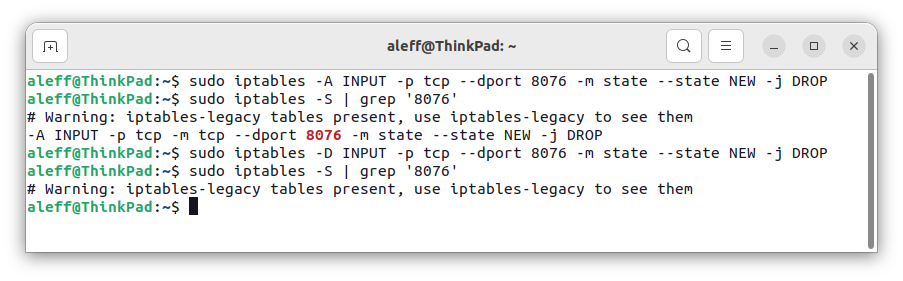

# Defend yourself against AtlasVPN *Bug-Door*

This script has been developed to allow you to mitigate a well-known vulnerability in the AtlasVPN client based on its APIs, which, as of today, has not been resolved. The term "bugdoor" has been coined to describe this situation, as the bug has been reported multiple times without being addressed, effectively creating an open backdoor (bug + backdoor).

**Category**: Incident Response

## Table of contents:

- Payload description
- AtlasVPN vulnerability
- - Summary
- - Dependencies
- Settings
- - Administrative Privileges
- - Set the rule
- - See the rule
- - Remove the rule
- Credits

## Payload description

This payload arises from the need to address a 0day vulnerability, which is now reasonable to assume has been known for mounths (maybe years), within the Linux client of AtlasVPN version 1.0.3. This vulnerability leads to a leakage of the user's real IP address, a situation that typically requires a prompt response from the company to provide a resolution patch and mitigate potential attacks.

However, in this case, the user who discovered the vulnerability had already proactively informed and reported it to the company in question. Surprisingly, up to this point, the company has not only failed to release any patches but has also not made any statements regarding the issue. This raises serious doubts about the nature of the problem, prompting questions (as highlighted by the vulnerability reporter) about the possibility that it might be an intentional bug or a deliberate backdoor, given that it is such a trivial error that it is absurd it hasn't been addressed proactively.

It's important to emphasize that these considerations represent personal opinions based on the original 0day report's message and should encourage discussions about cybersecurity and the reliability of the VPN service offered. If the company decides to provide a patch, it should also be required to explain the reason behind this prolonged negligence.

## AtlasVPN vulnerability

From [AtlasVPN Linux Client 1.0.3 Remote Disconnect Exploit](https://www.reddit.com/r/cybersecurity/comments/167f16e/atlasvpn_linux_client_103_remote_disconnect/)

>  The following is my 0day. This code, when executed on any website, disconnects the AtlasVPN linux client and leaks the users IP address. I am not yet aware of it being used in the wild. However, it shows that AtlasVPN does not take their users safety serious, because their software security decisions suck so massively that its hard to believe this is a bug rather than a backdoor. Nobody can be this incompetent. I tried to contact their support to get hold of a security contact, a pgp key or any signs of a bug bounty programme. Nope. No answer.

### Summary

>  The AtlasVPN Linux Client consists of two parts. A daemon (atlasvpnd) that manages the connections and a client (atlasvpn) that the user controls to connect, disconnect and list services. The client does not connect via a local socket or any other secure means but instead it opens an API on localhost on port 8076. It does not have ANY authentication. This port can be accessed by ANY program running on the computer, including the browser. A malicious javascript on ANY website can therefore craft a request to that port and disconnect the VPN. If it then runs another request, this leaks the users home IP address to ANY website using the exploit code.

The exploit code will not be included in this payload, as the primary goal here is defensive, not offensive. It's important to note that it's relatively easy to find a fully functional Proof of Concept (POC) for this vulnerability online if you need it for vulnerability testing purposes.

### Dependencies

Source [1]: https://www.reddit.com/r/cybersecurity/comments/167f16e/atlasvpn_linux_client_103_remote_disconnect/

Source [2] (Italian article): https://www.redhotcyber.com/post/ce-poco-da-nascondersi-il-bug-sul-client-di-atlas-vpn-rende-tutti-visibili/

## Settings

In order to mitigate this critical vulnerability, it is imperative to understand its operation at a more detailed level. Specifically, in the case of the AtlasVPN client, it is relevant to note that it opens an API service on localhost at port 8076 without any form of authentication. This lack of authentication allows, based on this specific detail, full access not only to any programs running on the computer but also (and this is the most concerning aspect) to any website making appropriate requests. This is an extremely serious vulnerability that exposes the user significantly. Therefore, waiting for a patch is not acceptable, and it is essential to take prompt action, even independently, perhaps using this payload.

This "home-made" solution involves partially closing port 8076, specifically by disabling the ability to establish new incoming connections through the same port. It is important to note that there are various attack strategies that could potentially bypass this protection, but at least a basic level of security is applied, which is not present by default. It is crucial to understand that this solution does not completely resolve the vulnerability but rather reduces the risk of being targeted by attacks based on it.

### Administrative Privileges

To apply this homemade patch, you will need to set up a Firewall rule, and therefore, you must have knowledge of the password to acquire administrator or root permissions.

### Set the rule

The Firewall rule that will be set will aim to block all connections that try to create a new connection on port 8076.

`sudo iptables -A INPUT -p tcp --dport 8076 -m state --state NEW -j DROP`

**sudo**: The command is run with administrator or root privileges to allow configuration of firewall rules.

**iptables**: This is the command for configuring the firewall iptables.

**-A INPUT**: This indicates that the rule will be added to the input chain, which handles incoming traffic.

**-p tcp**: This specifies that the rule applies only to TCP traffic.

**--dport 8076**: Specifies that the rule applies to traffic destined for port 8076.

**-m state --state NEW**: Uses the "state" form to specify that the rule applies only to new incoming connections ("NEW" state).

**-j DROP**: Indicates that the action to be taken for matches to this rule is "DROP," i.e., rejecting or blocking the connection.

### See the rule

If you want to see the rule you can use the command `iptables -S` with `grep "8076"`.

`sudo iptables -S | grep "8076"`

### Remove the rule

One of the ways to delete iptables rules is by rule specification. To do so, you can run the iptables command with the -D option followed by the rule specification.

`sudo iptables -D INPUT -p tcp --dport 8076 -m state --state NEW -j DROP`

## Credits

<h2 align="center"> Aleff :octocat: </h2>

<table>
  <tr>
    <td align="center" width="96">
      
       Github
    </td>
    <td align="center" width="96">
      
       Linkedin
    </td>
  </tr>
</table>

