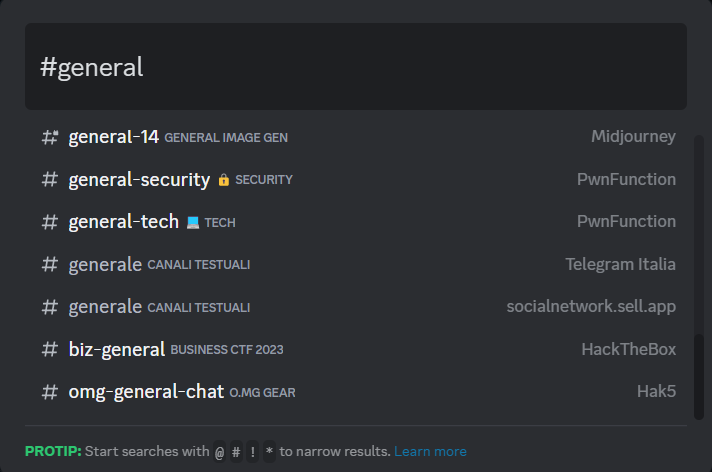
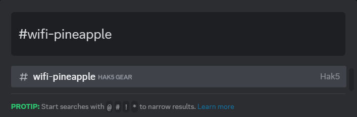

# Send Messages In Discord Channel-Server

This script can be used to send messages in a specific channel of a Discord text server.

**Category**: Execution

## Description

This script can be used to send messages in a specific channel of a Discord text server.

Open the GUI interface and trough this one open the Discord app, then use the keyboard shortcut CTRL-k to open the server chat.

**Note** that if you want to send a message within a chat that has a very common name such as #general then be aware that it is very likely that the chat of the server in which you want to send the message will not be selected but some other. If, on the other hand, you want to send it in a chat with a somewhat more specific name such as wifi-pineapple (Hak5's text channel) then almost certainly the channel in which you wish to send the message will be selected.

## Dependencies

* Discord Installed
* Internet connection

## Settings

- If, for example, the server is Hak5 and the channel in which you want to send the message is called wifi-pineapple then you should write just wifi-pineapple

    `[18] DEFINE #CHAT_NAME example`

- This depends on the power of the computer and whether there are upgrades to be done

    `[27] DELAY 6000`

## Credits

<h2 align="center"> Aleff :octocat: </h2>

<table>
  <tr>
    <td align="center" width="96">
      
       Github
    </td>
    <td align="center" width="96">
      
       Linkedin
    </td>
  </tr>
</table>

