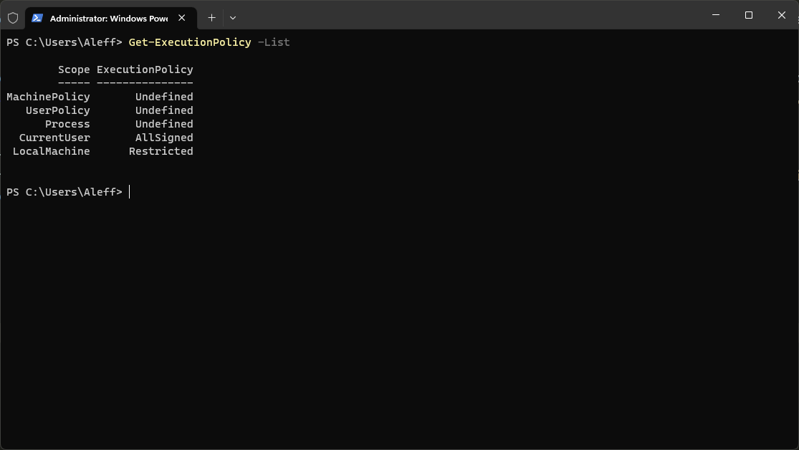
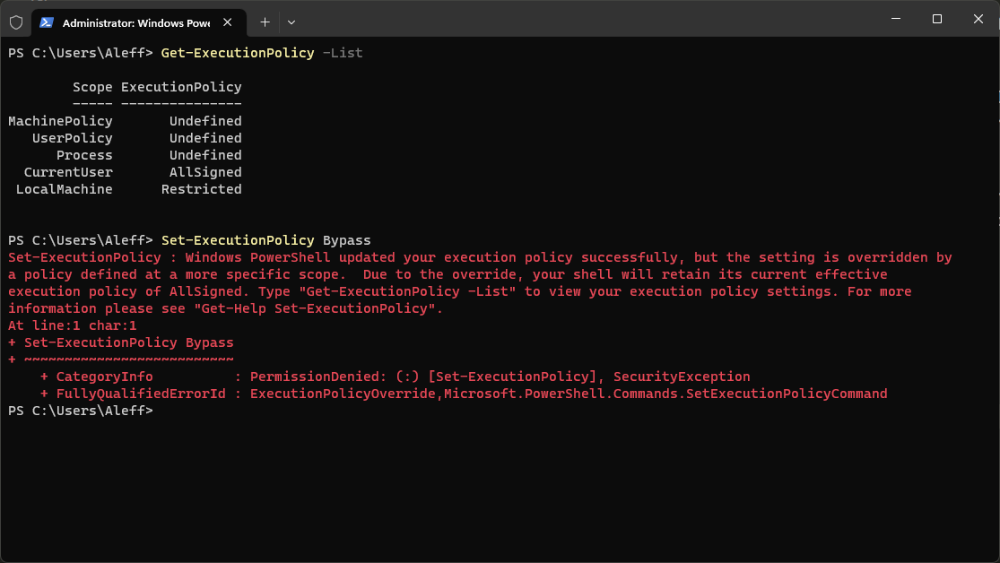
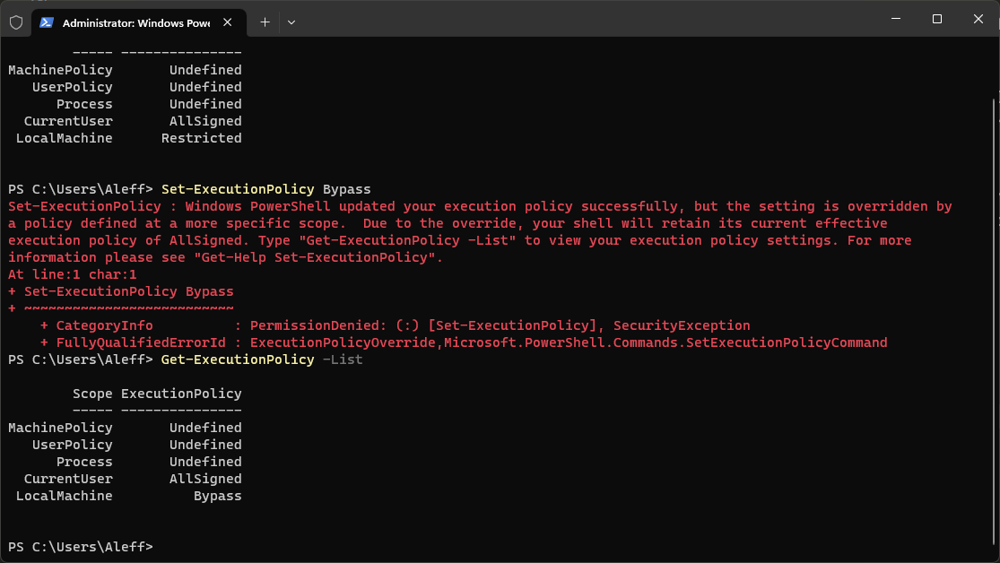

# Starting a PowerShell with administrator permissions in Windows 10/11

This script can be considered by people who are new to the world of scripts written in DuckyScript so that they can understand how to start a PowerShell with administrator permissions on a Windows machine.

**Category**: Execution

## Description

This script can be considered by people who are new to the world of scripts written in DuckyScript so that they can understand how to start a PowerShell with administrator permissions on a Windows machine.

Starting a PowerShell session with administrator privileges means the session has access to features and operations that require high permissions on the Windows operating system.

Some PowerShell commands require administrator privileges to run properly. Starting PowerShell as an administrator allows you to execute commands that require elevated permissions, such as managing system services, changing security settings, creating or modifying user accounts, installing system-level software, and so on.

It is important to note that running PowerShell with administrator privileges involves a higher level of responsibility and can cause significant changes to the system. Therefore, it is advisable to be careful and fully understand the effects of operations performed in a session with administrator privileges to avoid unwanted or harmful changes.

## Dependencies

* Nothing

## Example

- `STRINGLN Get-ExecutionPolicy -List`

- `STRINGLN Set-ExecutionPolicy Bypass`

- `STRINGLN Get-ExecutionPolicy -List`

## Credits

<h2 align="center"> Aleff :octocat: </h2>

<table>
  <tr>
    <td align="center" width="96">
      
       Github
    </td>
    <td align="center" width="96">
      
       Linkedin
    </td>
  </tr>
</table>

