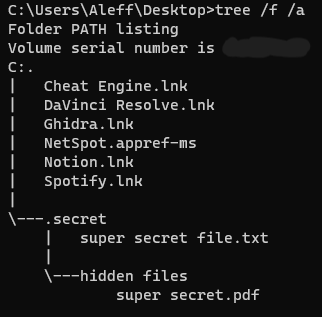

# Tree Structure Of The Operating System

This script allows the exfiltration of the structure of the files contained in a machine, through the use of the tree command in fact it is possible to know all the various links between files, folders and subfolders in a quick and graphically easy to understand way.

**Category**: Exfiltration

## Description

This script allows the exfiltration of the structure of the files contained in a machine, through the use of the tree command in fact it is possible to know all the various links between files, folders and subfolders in a quick and graphically easy to understand way.

Open a PowerShell and run the command `tree /f /a > out.txt` that permit to list the file name and not only the directories, using text characters instead of graphic characters to display rows linking subdirectories. Save all the output in the out.txt file and then send this file through Dropbox.

I used the [DETECT_READY](https://shop.hak5.org/blogs/usb-rubber-ducky/detect-ready) extension.

## Dependencies

* Firefox must be installed

## Settings

- You must define your Dropbox accessToken or modify the exfiltration modality.

    `DEFINE #DROPBOX_ACCESS_TOKEN example`

- The path to check can be changed putting the full-path `tree <full-path> /f /a > out.txt`.

    - `tree \ /f /a > out.txt`
    - `tree C:\Users\Aleff\Documents /f /a > out.txt`

## Credits

<h2 align="center"> Aleff :octocat: </h2>

<table>
  <tr>
    <td align="center" width="96">
      
       Github
    </td>
    <td align="center" width="96">
      
       Instagram
    </td>
    <td align="center" width="96">
      
       Discord
    </td>
  </tr>
</table>

