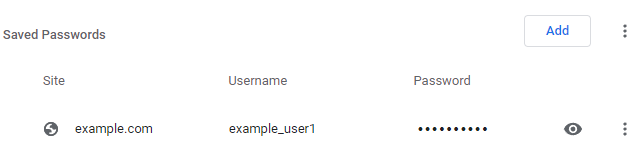
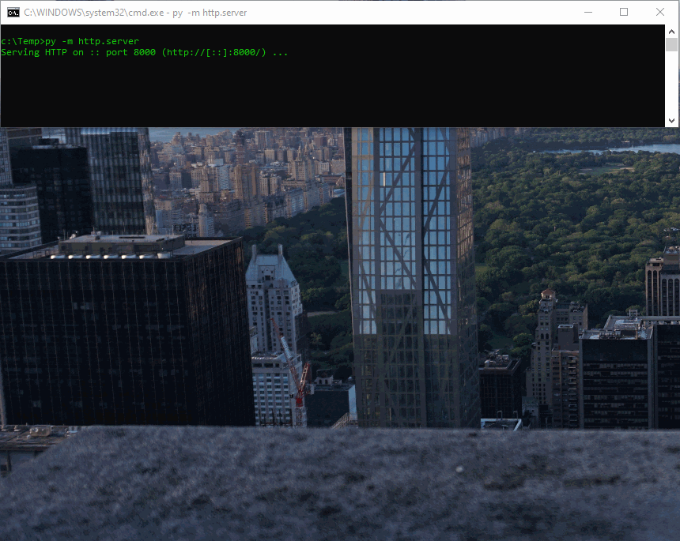

# Chrome saved-credentials exfiltration

A script to exfiltrate Chrome browser credentials from a target. Entered
interactively to bypass a lot of PowerShell-related AV triggers.

The Chrome GET request exfil is low bandwidth, but shouldn't raise the same
level of AV-detection alarm as Invoke-WebRequest.

## Dependencies

 * Windows 10
 * PowerShell 5.1 
   (or PowerShell 7.x if you want to capture post-Chrome-v80 passwords)
 * Chrome

## Configuration

Change `http://localhost:8000/` to match a target-accessible server you've set
up.

## Example execution

Passwords stored in Chrome:

Ducky script running, with temporary Python server to capture the
exfiltration:

The base64 string sent to the server
(`aHR0cHM6Ly9leGFtcGxlLmNvbS8sZXhhbXBsZV91c2VyMSxleEBtcGwzUEFTU3cwckQh`)
decodes to `https://example.com/,example_user1,ex@mpl3PASSw0rD!`.

## Limitations

There are various limitations around maximum URL lengths, you may run in to
these with Chrome instances containing a lot of saved passwords. A ZIP
compression pass would probably resolve this, or multiple GET requests.

I haven't tested this with Unicode passwords.

## Credits

This script is based on the minification of my
[chrome-decrypt.ps1](https://github.com/thisismyrobot/chrome-decrypt.ps1)
script, which itself built upon these projects:

 * https://github.com/p0z/CPD
 * https://github.com/ValterBricca/SQLite.Net-PCL
 * https://github.com/ericsink/SQLitePCL.raw
 * https://github.com/byt3bl33d3r/chrome-decrypter
 * https://github.com/agentzex/chrome_v80_password_grabber
 * https://github.com/0xfd3/Chrome-Password-Recovery
