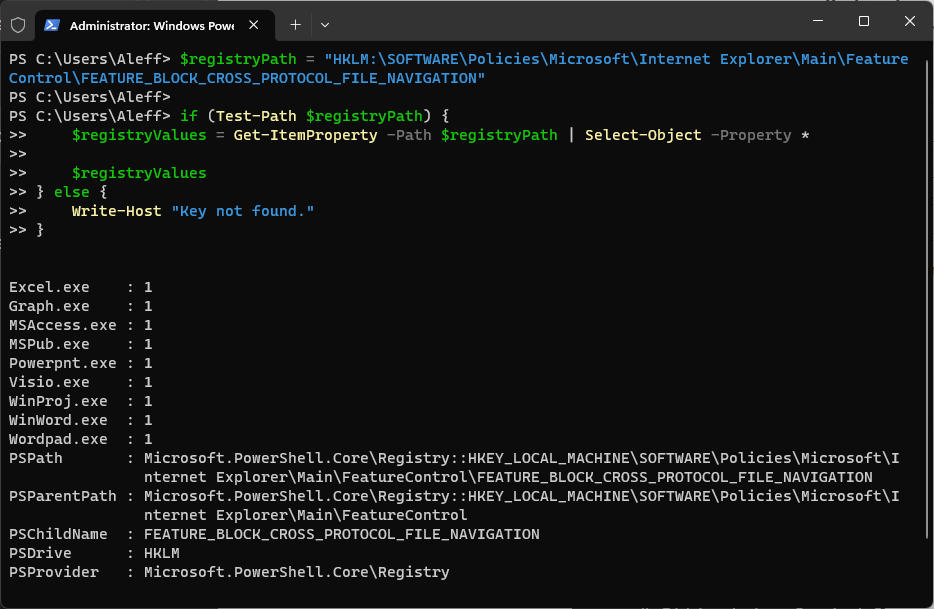
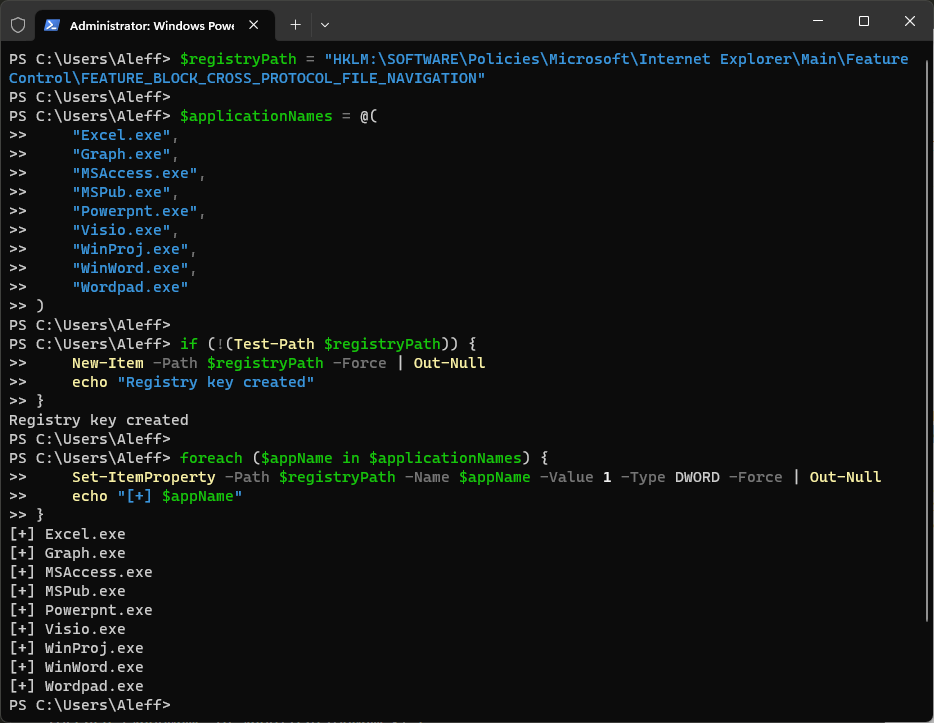
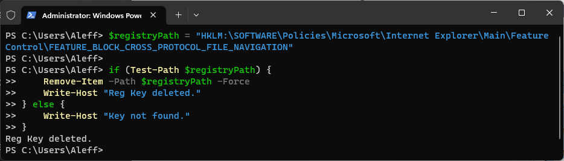

# Defend yourself against CVE-2023-36884 Office and Windows HTML Remote Code Execution Vulnerability

This script allows you to set the Register Key block rule that will allow you to defend against CVE-2023-36884.

**Category**: Incident Response

## Table of Contents

- [Payload Description](#payload-description)
- [CVE-2023-36884 Description](#cve-2023-36884-description)
  - [Summary](#summary)
  - [Note](#note)
  - [Dependencies](#dependencies)
- [Settings](#settings)
  - [Administrative Privileges](#administrative-privileges)
  - [Set the rule](#set-the-rule)
  - [See the new rule](#see-the-new-rule)
  - [Remove the rule](#remove-the-rule)
- [Credits](#credits)

## Payload Description

This script allows you to set the Register Key block rule that will allow you to defend against CVE-2023-36884.

Open a PowerShell, set the Register Key block rule trough the [command line interface](https://learn.microsoft.com/en-us/powershell/scripting/samples/working-with-registry-keys?view=powershell-7.3).




## CVE-2023-36884 Description

### Summary 

Microsoft is investigating reports of a series of remote code execution vulnerabilities impacting Windows and Office products. Microsoft is aware of targeted attacks that attempt to exploit these vulnerabilities by using specially-crafted Microsoft Office documents.

An attacker could create a specially crafted Microsoft Office document that enables them to perform remote code execution in the context of the victim. However, an attacker would have to convince the victim to open the malicious file.

Upon completion of this investigation, Microsoft will take the appropriate action to help protect our customers. This might include providing a security update through our monthly release process or providing an out-of-cycle security update, depending on customer needs.

Please see the Microsoft Threat Intelligence [Blog Entry](https://www.microsoft.com/en-us/security/blog/2023/07/11/storm-0978-attacks-reveal-financial-and-espionage-motives/) for important information about steps you can take to protect your system from this vulnerability.

This CVE will be updated with new information and links to security updates when they become available. If you wish to be notified when these updates are released, we recommend that you register for the security notifications mailer to be alerted of content changes to this CVE. See [Microsoft Technical Security Notifications](https://www.microsoft.com/en-us/msrc/technical-security-notifications?rtc=1) and [Security Update Guide Notification System News: Create your profile now – Microsoft Security Response Center](https://msrc.microsoft.com/blog/2022/08/security-update-guide-notification-system-news-create-your-profile-now/).

Source: https://msrc.microsoft.com/update-guide/vulnerability/CVE-2023-36884

### Note

Tested on:
- Windows 11 Eng

### Dependencies

* ExecutionPolicy Bypass

## Settings

In this payload, I created a new registry key called "FEATURE_BLOCK_CROSS_PROTOCOL_FILE_NAVIGATION." All of the following application names are then added as a value of type REG_DWORD with data 1.

- Excel.exe
- Graph.exe
- MSAccess.exe
- MSPub.exe
- Powerpnt.exe
- Visio.exe
- WinProj.exe
- WinWord.exe
- Wordpad.exe

Remember that you must run PowerShell with administrative privileges to create and manage registry keys.

### Administrative Privileges

- I used the Payload [Starting a PowerShell with administrator permissions in Windows 10/11](https://github.com/hak5/usbrubberducky-payloads/tree/master/payloads/library/execution/Starting_a_PowerShell_with_administrator_permissions_in_Windows) by Hak5 Payloads

```
DELAY 1000
GUI x
DELAY 500
STRING a
DELAY 500
LEFT_ARROW
DELAY 500
ENTER
```

### Set the rule



### See the new rule


### Remove the rule



## Credits

<h2 align="center"> Aleff :octocat: </h2>
<div align=center>
<table>
  <tr>
    <td align="center" width="96">
      <a href="https://github.com/aleff-github">
        
      </a>
      <br>Github
    </td>
    <td align="center" width="96">
      <a href="https://www.linkedin.com/in/alessandro-greco-aka-aleff/">
        
      </a>
      <br>Linkedin
    </td>
  </tr>
</table>
</div>