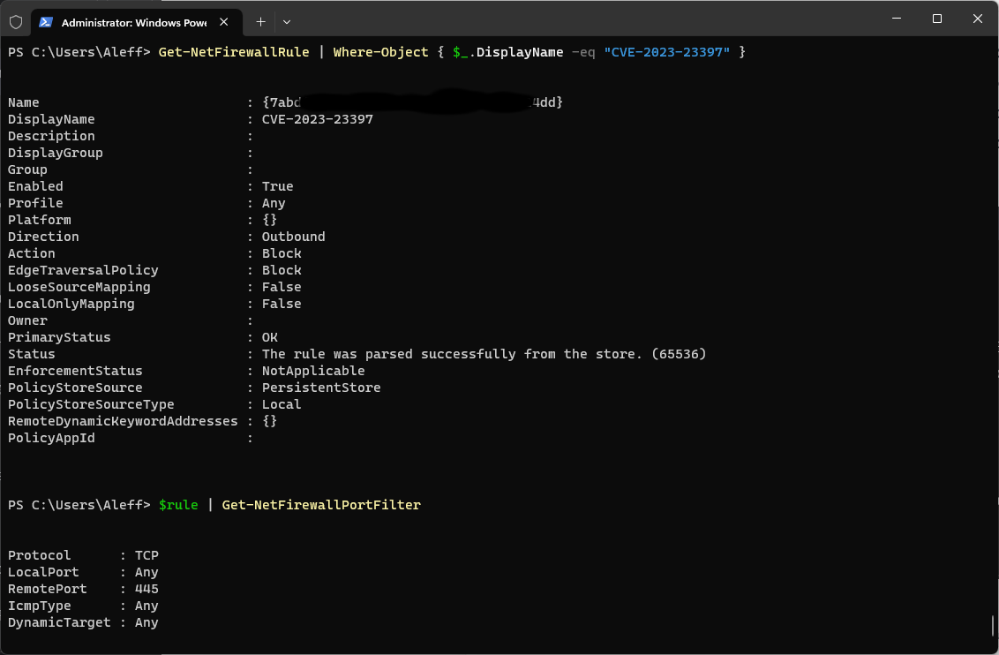
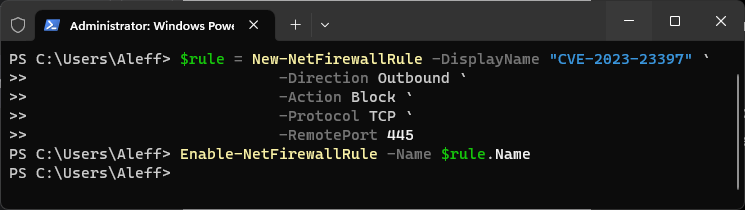
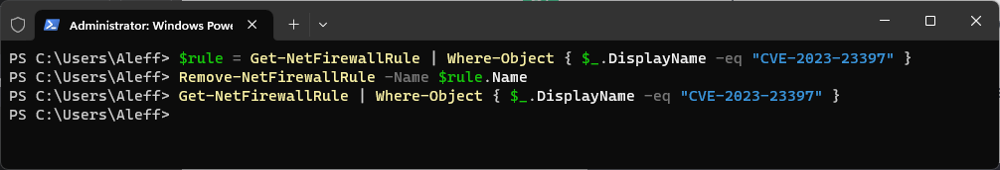

# Defend Yourself From CVE-2023-23397

This script allows you to set the Firewall rule that will allow you to defend against CVE-2023-23397.

**Category**: Incident-Response

*I decided to set Credentials as the category because of the type of CVE.*

## Index

- [Defend Yourself From CVE-2023-23397](#defend-yourself-from-cve-2023-23397)
  - [Payload Description](#payload-description)
  - [CVE-2023-23397 Description](#cve-2023-23397-description)
    - [Summary](#summary)
    - [Impacted Products](#impacted-products)
    - [Technical Details](#technical-details)
  - [Note](#note)
  - [Dependencies](#dependencies)
  - [Settings](#settings)
    - [Administrative Privileges](#administrative-privileges)
    - [Set the rule](#set-the-rule)
    - [See the new rule](#see-the-new-rule)
    - [Remove the rule](#remove-the-rule)
  - [Credits](#credits)

## Payload Description

This script allows you to set the Firewall rule that will allow you to defend against CVE-2023-23397.

Open a PowerShell, set the Firewall rule trough NetSecurity module.



## CVE-2023-23397 Description

### Summary 

Microsoft Threat Intelligence discovered limited, targeted abuse of a vulnerability in Microsoft Outlook for Windows that allows for new technology LAN manager (NTLM) credential theft to an untrusted network, such as the Internet. Microsoft has released CVE-2023-23397 to address the critical elevation of privilege (EoP) vulnerability affecting Microsoft Outlook for Windows. We strongly recommend all customers update Microsoft Outlook for Windows to remain secure.

### Impacted Products

All supported versions of Microsoft Outlook for Windows are affected. Other versions of Microsoft Outlook such as Android, iOS, Mac, as well as Outlook on the web and other M365 services are not affected.

### Technical Details

CVE-2023-23397 is a critical EoP vulnerability in Microsoft Outlook that is triggered when an attacker sends a message with an extended MAPI property with a UNC path to an SMB (TCP 445) share on a threat actor-controlled server on an untrusted network. No user interaction is required.

The threat actor is using a connection to the remote SMB server sends the user’s NTLM negotiation message, which the attacker can then relay for authentication against other systems that support NTLM authentication.

**Source**: https://msrc.microsoft.com/blog/2023/03/microsoft-mitigates-outlook-elevation-of-privilege-vulnerability/

## Note

Tested on:
- Windows 11 Eng

## Dependencies

* ExecutionPolicy Bypass
* PayloadStudio 1.3.1

## Settings

In this payload, I created a new firewall rule called "CVE-2023-23397". The direction is set to "Outbound," the action is "Block" (block traffic), the protocol is "TCP," and the remote port is 445 (SMB). Next, the rule is enabled using the Enable-NetFirewallRule cmdlet by specifying the name of the previously created rule.

Remember that you must run PowerShell with administrative privileges to create and manage firewall rules.

### Administrative Privileges

- I used the Payload [Starting a PowerShell with administrator permissions in Windows 10/11](https://github.com/hak5/usbrubberducky-payloads/tree/master/payloads/library/execution/Starting_a_PowerShell_with_administrator_permissions_in_Windows) by Hak5 Payloads

```
DELAY 1000
GUI x
DELAY 500
STRING a
DELAY 500
LEFT_ARROW
DELAY 500
ENTER
```

### Set the rule



### See the new rule


### Remove the rule



## Credits

<h2 align="center"> Aleff :octocat: </h2>
<div align=center>
<table>
  <tr>
    <td align="center" width="96">
      <a href="https://github.com/aleff-github">
        
      </a>
      <br>Github
    </td>
    <td align="center" width="96">
      <a href="https://www.linkedin.com/in/alessandro-greco-aka-aleff/">
        
      </a>
      <br>Linkedin
    </td>
  </tr>
</table>
</div>