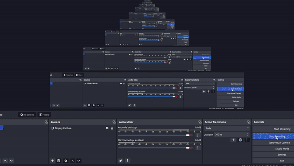

# Pranh(ex)

This script is named Prenh(ex) because it is the union between **Prank**, the payload section of Hak5, and hex which represents the heart of the payload itself since it is installed following a conversion to **hexadecimal**. This script also contains a Time-Based **Easter Egg** so if you want to enjoy the joke don't read the code and wait a few seconds. ^^

Executables have been removed for security reasons.

**Category**: Prank

## Description

This script is named Prenh(ex) because it is the union between Prank, the payload section of Hak5, and hex which represents the heart of the payload itself since it is installed following a conversion to hexadecimal. This script also contains a Time-Based Easter Egg so if you want to enjoy the joke don't read the code and wait a few seconds. ^^

Installing and running executables on machines without explicit owner authorization can **lead to significant damage** both to the **machine** and **legal repercussions** for those who choose to do so. It is crucial to respect ownership rights and seek proper authorization to ensure the security and integrity of the system while staying within the boundaries of the law.

## Explanation of Prank

This Python script is designed to be a playful prank, creating a series of unexpected and humorous pop-up messages that make it challenging for the user to close the windows. It utilizes the ctypes library to interact with the Windows API for displaying message boxes with customized icons and button options. The code defines a function, show_error_popup, which takes a message as input and enters an infinite loop, constantly prompting the user with pop-up messages. These messages employ amusing responses to user interactions, such as changing the message text or providing comical feedback. Overall, it's a lighthearted piece of code that aims to entertain and surprise anyone who runs it.

1. You import the necessary libraries, such as ctypes and sleep.

2. You define a show_error_popup function that takes a message as an argument.

3. Inside this function, you start an infinite while loop.

4. You use ctypes.windll.user32.MessageBoxW to create a popup with the specified message. This popup has an error icon (MB_ICONERROR) and a single "OK" button (MB_OK).

5. You check the result returned by the dialog window. If the user clicks "OK" (returned value 1), the message is changed to "What do you believe yourself? That I leave so easily?" and the popup is reopened.

6. If the user clicks "Cancel" (returned value 2), a second popup is displayed with the message "Are you sure you want to close? I will miss you :'(". This popup has an error icon (MB_ICONERROR) and two buttons: "Yes" and "No."

7. If the user clicks "Yes" (returned value 6) in the second popup, a third popup appears with the message "Okay, I'll stop. But don't get mad...". This popup has an information icon (MB_ICONINFORMATION), and the loop is terminated, thus closing the popup.

8. If the user clicks "No" in the second popup, the message is changed to "You seem a little indecisive honestly...", and the popup is reopened.

9. Finally, the show_error_popup function is called with an initial error message, and the popup will be opened. After the user interacts with the popup, there is a 60-second delay before a final popup is displayed with a farewell message.

In summary, the code creates a popup that playfully teases the user, making it challenging to close, and providing some humorous responses to user clicks. It's a little prank that might bring a smile to anyone who runs it.

## Dependencies

* **Nothing** (i know, it's absurd)

## Note

- For the creation of the executable, the hexadecimal code and in general to create this program I stuck to the payload: `Install And Run Any Arbitrary Executable - No Internet And Root Needed`
- Tested on `Windows 11`
- Running checked but not blocked by Avast antivirus
- Original Python code in `assets/pranh(ex).py`
- Hex content in `assets/hexfile.txt`
- exe file in `assets/pranh(ex).exe`

## Credits

<h2 align="center"> Aleff :octocat: </h2>

<table>
  <tr>
    <td align="center" width="96">
      
       Github
    </td>
    <td align="center" width="96">
      
       Linkedin
    </td>
  </tr>
</table>

