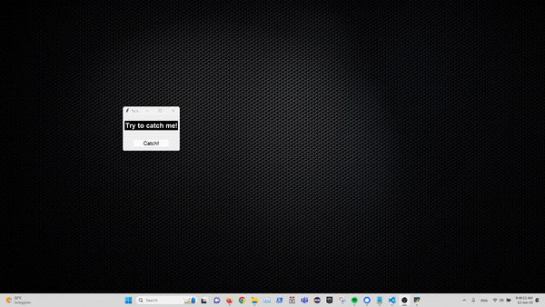

# Try To Catch Me

A script used to prank your friends with a script that will create a TryToCatchMe popup uncatchable.

**Category**: Prank

## Description

A script used to prank your friends with a script that will create a TryToCatchMe popup uncatchable.

Open a PowerShell, download the Python script and execute it. The Python script will create the popup through the Tk Popup.

## Getting Started

## Dependencies

* Python
* Internet Connection

## Settings

- Setup your Python script link

    `DEFINE SCRIPT-PY-LINK example.com`

## Credits

<h2 align="center"> Aleff :octocat: </h2>

<table>
  <tr>
    <td align="center" width="96">
      
       Github
    </td>
    <td align="center" width="96">
      
       Linkedin
    </td>
  </tr>
</table>

