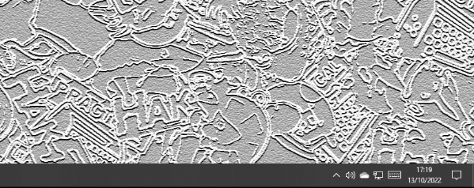

# Desktop Duck
- Author: Cribbit
- Version: 1.0
- Target: Windows 10 (Powershell 5.1+) + .net wpf
- Category: Pranks
- Attackmode: HID & Storage
- Ducky Version: 2

## Change Log
| Version | Changes         |
| ------- | --------------- |
| 1.0     | Initial release |

## Description
Shows a Duck that move along the bottom of the screen.

Creates a WPF window which is inviable apart form an image of a duck.
Then the script moves the screen along the bottom of the desktop. 
When it reaches to far side it flips the image and move the duck in the opposite direction.

## How to get ride of the duck
Right Click on the duck will close the window.
