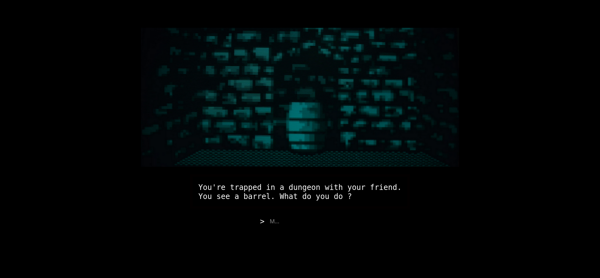
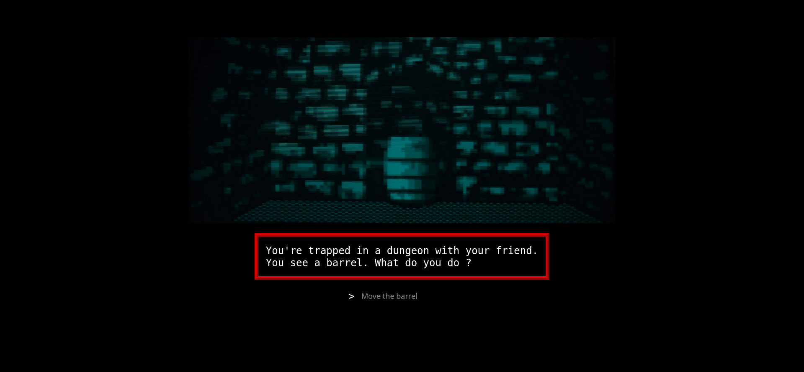

# "Mr. Robot" - eXit

- Title:         "Mr. Robot" - eXit
- Author:        TW-D
- Version:       1.0
- Category:      Prank

## Description


You're Elliot, playing the **eXit** adventure game that Whiterose left you 
on an old computer to put an end to his project *(S4E11)*.

## Configuration

In the "payload.txt" file, replace the values of the following constants :

```

REM ---
REM USB Rubber Ducky label.
REM ---
DEFINE #RD_LABEL DUCKY

REM ---
REM Enable/Disable hints.
REM - TRUE if you don't know the exact answers given by Elliot in both parts.
REM - FALSE only if you know the exact answers given by Elliot in both parts.
REM ---
DEFINE #HINT TRUE

```

## Usage

At the root of the USB Rubber Ducky, copy the "prank_files/" folder.

## Screenshots

>
> Without hints.
>



>
> With hints.
>

